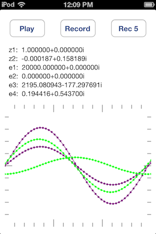
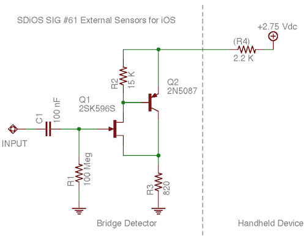

# ImpBridge
AC Impedance Bridge server for iOS, client runs on MacOS.

As described at http://www.williamsonic.com/ImpBridge/index.html

Screen shot of iOS app which measures AC impedance.  External bridge circuit is driven by the headphone ouput, imbalance is detected through the mic input.  Runs as a measurement server, exposing a socket interface over WiFi.

Screen shot of MacOS client app interacting with measurement server through a socket interface.

Detector circuit measures bridge imbalance, adapted for connection to the mic input of a handheld device.

